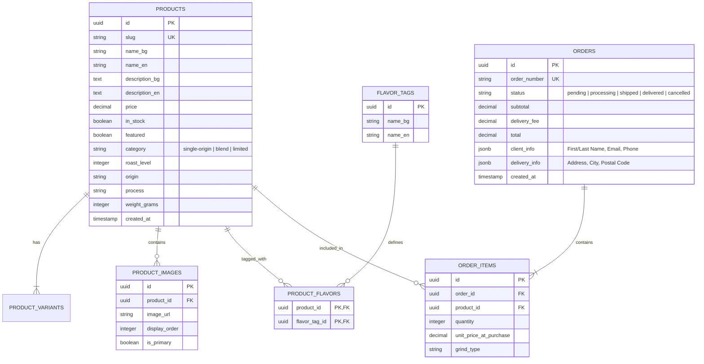

# Database Design Specification

**Status**: Draft
**Version**: 1.1
**Date**: 2025-12-28
**Author**: Lead Software Architect

## 1. Executive Summary

This document outlines the relational database schema designed to replace the current client-side JSON/LocalStorage data persistence. The design targets a **PostgreSQL** database, chosen for its reliability, strict typing, and rich feature set. The schema prioritizes data integrity and a simplified **guest-checkout only** model, as no user authentication is required.

## 2. Entity-Relationship Diagram (ERD)

## 3. Schema Details

### 3.1 Core Entities

#### `products`
The central catalog entity.
- **id**: UUID, Primary Key.
- **slug**: URL-friendly identifier (e.g., `mass-appeal`), Unique.
- **name_bg/en**: Localized names.
- **price**: stored as `DECIMAL(10,2)` to avoid floating point errors.
- **roast_level**: Integer (1-5).
- **process**: e.g., "Washed", "Natural".

#### `orders`
Represents a completed customer transaction.
- **order_number**: Human-readable ID (e.g., `RC-2025-00123`), Unique.
- **client_info**: `JSONB` containing `firstName`, `lastName`, `email`, `phone`.
- **delivery_info**: `JSONB` containing `address` or `pickupLocation`.
- **status**: Enum-like string constraints. Creates with 'pending'.
- **Note**: No `user_id` linkage. All user data is snapshotted per order.

### 3.2 Junction Tables

#### `product_flavors` & `flavor_tags`
Instead of an array of strings in the product table, we use a normalized many-to-many relationship. This allows for:
- Consistent spelling of flavor notes (e.g., "Chocolate" vs "chocolate").
- Efficient filtering (e.g., "Show all coffees with 'Fruity' notes").

## 4. Technology Selection

### 4.1 Database Engine: **PostgreSQL 16+**
**Rationale**: 
- **ACID Compliance**: Critical for financial transactions (orders).
- **JSONB Support**: Allows storing complex delivery/client details flexibly while maintaining relational integrity for core data.
- **Ecosystem**: Industry standard, easily hosted (Supabase via Docker locally or Cloud).

### 4.2 ORM/Query Builder: **Supabase (PostgREST)**
**Rationale**:
- **Supabase**: Provides instant REST APIs over the Postgres schema.
- **Simplicity**: No need for a custom Node.js/Express backend layer just to forward CRUD requests.

## 5. Security & Scalability

### 5.1 Security
- **Row Level Security (RLS)**: Enabled on all tables.
  - `products`: Public read (anon), Admin write (service_role).
  - `orders`: Public insert (anon), Admin read/write (service_role). **No public read** (guest users cannot list orders; they see success page only via local state).
- **Input Validation**: Enforced at Database level (Check constraints, Not Nulls) and API level.

### 5.2 Scalability
- **Indexing**:
  - `products(slug)`: For fast page lookups.
  - `orders(order_number)`: For support lookups.
- **Denormalization**: `unit_price_at_purchase` in `order_items` prevents price changes from corrupting historical order data.

## 6. Migration Strategy
1. **Initialize**: Create tables and constraints.
2. **Seed**: Migration script to transform `products.json` into SQL inserts.
3. **Switch**: Update frontend API calls to fetch from DB instead of JSON.
